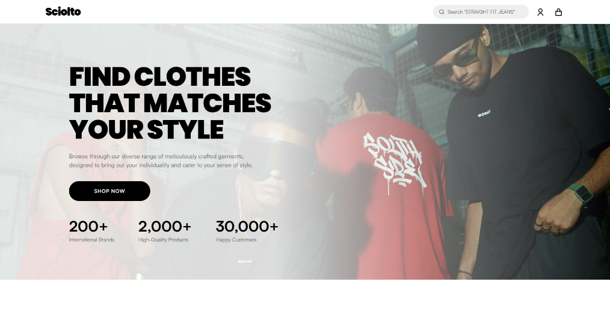

<!-- prettier-ignore -->
<div align="center">

# Sciolto

*Sciolto is a premium, full-stack streetwear e-commerce platform featuring modular BEM Sass layouts, database transactions for concurrent checkout safety, client-side pagination caching, and CDN-backed media delivery.*

[](https://sciolto.aryanpatel.in) [](https://react.dev) [](https://nodejs.org) [](https://expressjs.com) [](https://www.mongodb.com) [](https://redis.io)

[Live Demo](https://sciolto.aryanpatel.in) • [Client Documentation](./client/README.md) • [Server Documentation](./server/README.md) • [GitHub Repository](https://github.com/aryanpatel287/sciolto)

</div>

## Preview



## Core Engineering Highlights

* **Transactional Concurrency Control** — Utilizes Mongoose database sessions and multi-document transactions to run atomic inventory checks (`variants.stock: { $gte: quantity }`) and updates (`$inc`) during payments, preventing stock overselling under high concurrency.
* **Client-Side Page Caching** — Integrates a Redux Toolkit cache (`productsByPage`) to store loaded product catalog pages, making back-and-forth category transitions instant (0ms) while dynamically invalidating cache entries on filter/sort resets.
* **Server-Side Catalog Query Engine** — Offloads compound search, category matching, price filters, and pagination directly to optimized MongoDB index queries rather than processing large datasets in-memory on the client.
* **Dynamic Variant Modeling** — Models products as polymorphic entities with nested variants, allowing independent sizing, colors, pricing, inventory stock, and media galleries that resolve dynamically based on user selections.
* **Decoupled Security Shield** — Mounts custom Express middleware to intercept and drop web scanners looking for backup files (`.bak`), configuration credentials (`.env`), or target script paths (`.php`), returning clean 404s before hitting backend controllers.

## Why I Built This

Sciolto was designed to explore full-stack engineering challenges that extend beyond basic UI mockups. The goal was to build an e-commerce architecture implementing production-grade backend safeguards: atomic stock inventory controls under concurrent Razorpay checkouts, dynamic variant swapping databases, a Redux page caching strategy for smooth UX, and robust middleware pipelines to secure authentication sessions.

## High-Level Architecture

```text
               ┌──────────────────────────────┐
               │    React SPA Client (Sass)   │
               └──────────────┬───────────────┘
                              │ Axios / REST API
                              ▼
               ┌──────────────────────────────┐
               │   Express.js Backend Engine  │
               └──────────────┬───────────────┘
                              │
     ┌────────────────────────┼────────────────────────┐
     ▼                        ▼                        ▼
┌───────────┐            ┌───────────┐            ┌───────────┐
│  MongoDB  │            │   Redis   │            │ ImageKit  │
│ (Mongoose)│            │ (ioredis) │            │ (CDN API) │
└───────────┘            └───────────┘            └───────────┘
```

The React client communicates with the Express REST API for catalog browsing, user authentication, cart state, checkout, and address management. Persistent e-commerce data is stored in MongoDB, while Redis acts as a high-speed token/session blacklist cache, and ImageKit manages direct-to-CDN media storage.

## Key Engineering Decisions

### 1. Server-Side catalog querying
Filtering, sorting, and pagination are executed directly on the database layer rather than loading catalog sets into client state. This reduces payload sizes over mobile connections and uses MongoDB compound indexing for fast search.

### 2. Client-side page caching
To prevent redundant API requests during back-and-forth navigation, previously fetched pages are stored in Redux. Any mutation of search filters or category selections automatically invalidates the cache to maintain catalog freshness.

### 3. Nested variant schema modeling
Instead of treating products as flat SKUs, variant attributes (size, color, stock) are modeled as nested sub-documents. This enables granular inventory tracking and ensures pricing and media update instantly when options match.

### 4. Redis-backed JWT invalidation
To prevent session replay attacks on logout, user tokens are blacklisted in a Redis store for the remainder of their TTL, turning stateless JWTs into a secure, revocable session mechanism.

## Tech Stack

| Layer | Technologies |
|---|---|
| **Frontend** | React 19 (Hooks/Context), Vite 7, Redux Toolkit, Axios |
| **Styling** | Sass / SCSS (Dart Sass `@use`, BEM naming conventions) |
| **Backend** | Node.js, Express.js (v5.x), Express Validator |
| **Database** | MongoDB (Mongoose v9.x) |
| **Caching** | Redis (`ioredis` v5.x) |
| **Media CDN** | ImageKit Node SDK, Multer |
| **Services** | Nodemailer, Gmail OAuth2, Resend API, Razorpay |
| **Testing** | Vitest, Supertest, Artillery (Load Testing) |

## Project Structure

```text
sciolto/
├── client/      → React frontend SPA (Vite)
├── server/      → Express API backend (Node.js ESM)
└── README.md    → Project overview & landing page
```

## Quick Start

### 1. Install Dependencies
Install packages in the client and server directories:
```bash
# Frontend dependencies
cd client && npm install

# Backend dependencies
cd ../server && npm install
```

### 2. Environment Variables
Copy `.env.example` in the `server` directory and fill in your database and service keys:
```bash
cd server
cp .env.example .env
```
*(For complete details, see the [Server Environment Setup Guide](./server/README.md#environment-variables).)*

### 3. Seed the Database
Populate standard category structures and inventory details:
```bash
cd server
npm run seed
```

### 4. Run the Application
Start the development servers:
```bash
# Start backend API (Terminal 1)
cd server && npm run dev

# Start frontend client (Terminal 2)
cd client && npm run dev
```

## Testing

The repository includes test suites covering both client and server layers:

* **Backend Integration Tests**: Runs Vitest suite testing Express routes, authentication validation, cart operations, and model validations.
  ```bash
  cd server && npm run test
  ```
* **Frontend Component Tests**: Evaluates UI hooks, features, and Redux slice handlers in React.
  ```bash
  cd client && npm run test
  ```
* **Performance Load Tests**: Executes Artillery load test scenarios verifying application performance under guest and authenticated load.
  ```bash
  cd server && npm run test:load
  ```

## Security Considerations

* **Secure Auth Sessions**: Utilizes HTTP-only cookies to store JWT session tokens, preventing cross-site scripting (XSS) token access.
* **Stateless Session Revocation**: Redis blacklisting marks tokens invalid on user logout before token expiration.
* **Database Sanitization & Input Validation**: Payload validation through `express-validator` prevents query injection.
* **Malicious Probe Isolation**: Early-stage middlewares drop suspicious scanner requests (`.env`, `.php`, `.bak`) to prevent API resource depletion.
